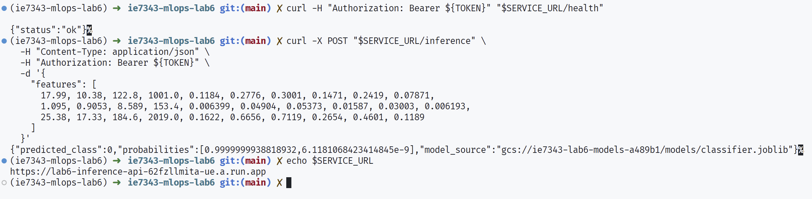
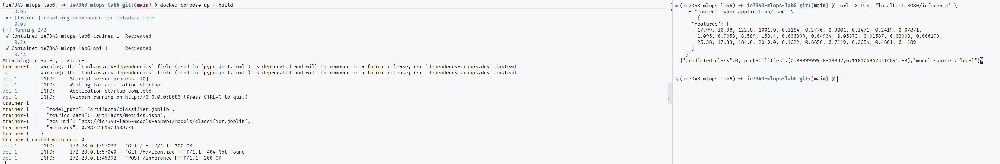

# ie7343-mlops-lab6

- Original lab starter: `Labs/GCP_Labs/Cloud_Runner_Labs/Intermediate_Lab` - Flask app with static storage upload and BigQuery demo query.
- Modified lab: train a real classification model, push it to GCS, and serve typed inference through FastAPI. There is two parts, a python script that creates/uploads a model, and a python script which acts as the web server.

## What changed

- Replaced Flask app with FastAPI and added a typed `POST /inference` endpoint.
- Added `train_model.py` to train a `LogisticRegression` classifier (sklearn breast cancer dataset), persist artifacts, and upload the model to GCS.
- Added model bootstrapping in the API: if the model is not present locally, the app downloads it from `MODEL_BUCKET`/`MODEL_OBJECT`.
- Added Terraform scripts to provision cloud resources (artifact bucket + service account + IAM bindings + Cloud Run service).
- Added uv-based dependency management via `pyproject.toml` and `uv.lock`.
- Added Docker Compose to run API and trainer containers locally.
- Updated Dockerfile to use uv + lockfile and run FastAPI via uvicorn.

## Expected Outputs

If you follow the instructions below, you can deploy the model and container runtime
to GCP which should let you see the following output:




Likewise, you can run this locally in docker



## Repo layout

Important files:

```
.
├── app.py                          # FastAPI app + model loading + /inference route
├── train_model.py                  # Trains classifier and uploads model artifact to GCS
├── Dockerfile                      # Container image (uv-managed dependencies)
├── docker-compose.yml              # Local API + trainer services
├── pyproject.toml                  # uv dependency source of truth
├── uv.lock                         # locked dependencies for reproducibility
├── .env.example                    # environment variable template
├── scripts/
│   └── deploy_cloud.sh             # terraform apply + model upload + cloud smoke tests
└── terraform/
    ├── versions.tf                 # provider/version constraints
    ├── variables.tf                # terraform inputs
    ├── main.tf                     # bucket + service account + IAM + Cloud Run service
    ├── outputs.tf                  # resource outputs
    └── terraform.tfvars.example    # sample values
```

## Prereqs

- Python 3.11+ and uv
- Docker + Docker Compose
- Terraform 1.14 (or higher)
- GCP project with billing enabled

## Terraform setup

Terraform files for resource creation live in `terraform`.

What it creates:

- Required Google APIs for this lab (Cloud Run, Artifact Registry, Cloud Build).
- A storage bucket for model artifacts using `model_bucket_name_prefix` plus a random suffix.
- An Artifact Registry Docker repository for API images.
- A service account for Cloud Run runtime.
- A Cloud Run service configured with `MODEL_BUCKET` and `MODEL_OBJECT`.
- Optional unauthenticated invoke policy (configurable in tfvars, default is private).

## Run steps

```bash
set -euo pipefail

# 0)  authenticate w/ GCP cli
gcloud auth application-default login

# 1) Install dependencies
uv sync

# 2) Prepare terraform variables
cd terraform
cp terraform.tfvars.example terraform.tfvars
# Edit terraform.tfvars with your project_id and optional values.
cd ..

# 3) One-command deploy
# If --image is omitted, the script will:
#   a) bootstrap Artifact Registry via Terraform,
#   b) derive IMAGE_URI from Terraform output,
#   c) build and push image with Cloud Build,
#   d) run full Terraform apply and smoke tests.
scripts/deploy_cloud.sh --auto-approve
```

Optional: if you already built an image yourself, pass it explicitly.

```bash
IMAGE_URI="us-east1-docker.pkg.dev/YOUR_PROJECT_ID/lab6-images/lab6-api:latest"
scripts/deploy_cloud.sh --image "${IMAGE_URI}" --auto-approve
```

The helper script runs:

- `terraform init` and, when needed, targeted bootstrap apply for Artifact Registry.
- Cloud Build image build/push when `--image` is omitted.
- Full `terraform apply` for all resources.
- Terraform output capture (`project_id`, `region`, `model_bucket`, `cloud_run_url`).
- Automatic `.env` creation from `.env.example` when missing.
- Automatic `.env` update for model bucket.
- `uv run python train_model.py` with the Terraform bucket output.
- Health and inference smoke tests against the deployed Cloud Run URL.

Note: by default, `allow_unauthenticated = false`, so Cloud Run calls require an identity token.

### Local Development
#### Local development setup

Create local `.env` for uv runs (optional if you already ran `scripts/deploy_cloud.sh`, since it auto-creates `.env`). Start with `cp .env.example .env`, then set `MODEL_BUCKET` and `GOOGLE_CLOUD_PROJECT`.

The app and trainer load `.env` automatically with `python-dotenv` for local `uv run` commands.

Train/upload via compose and start API:


```bash
docker compose up --build
```


## Call inference API in Cloud (manual)

Fetch the deployed URL:

```bash
cd terraform
SERVICE_URL=$(terraform output -raw cloud_run_url)
PROJECT_ID=$(terraform output -raw project_id)
TOKEN=$(gcloud auth print-identity-token)
cd ..
echo "$SERVICE_URL"
```

Check if up: 
```bash
curl -H "Authorization: Bearer ${TOKEN}" "$SERVICE_URL/health"
```

Call inference:

```bash
curl -X POST "$SERVICE_URL/inference" \
  -H "Content-Type: application/json" \
  -H "Authorization: Bearer ${TOKEN}" \
  -d '{
    "features": [
      17.99, 10.38, 122.8, 1001.0, 0.1184, 0.2776, 0.3001, 0.1471, 0.2419, 0.07871,
      1.095, 0.9053, 8.589, 153.4, 0.006399, 0.04904, 0.05373, 0.01587, 0.03003, 0.006193,
      25.38, 17.33, 184.6, 2019.0, 0.1622, 0.6656, 0.7119, 0.2654, 0.4601, 0.1189
    ]
  }'
```

## Cleanup

```bash
cd terraform
terraform destroy
```
